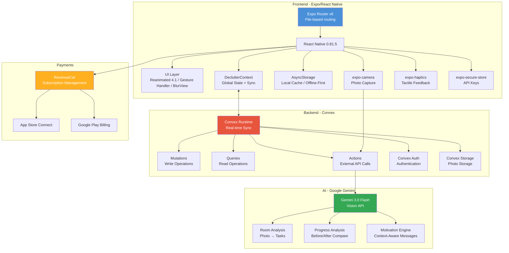
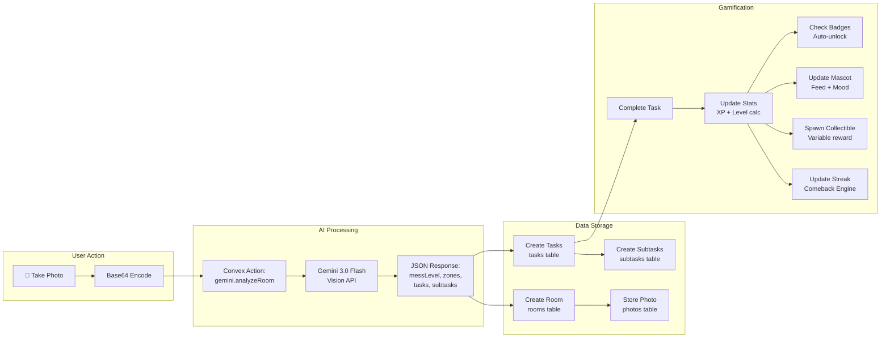
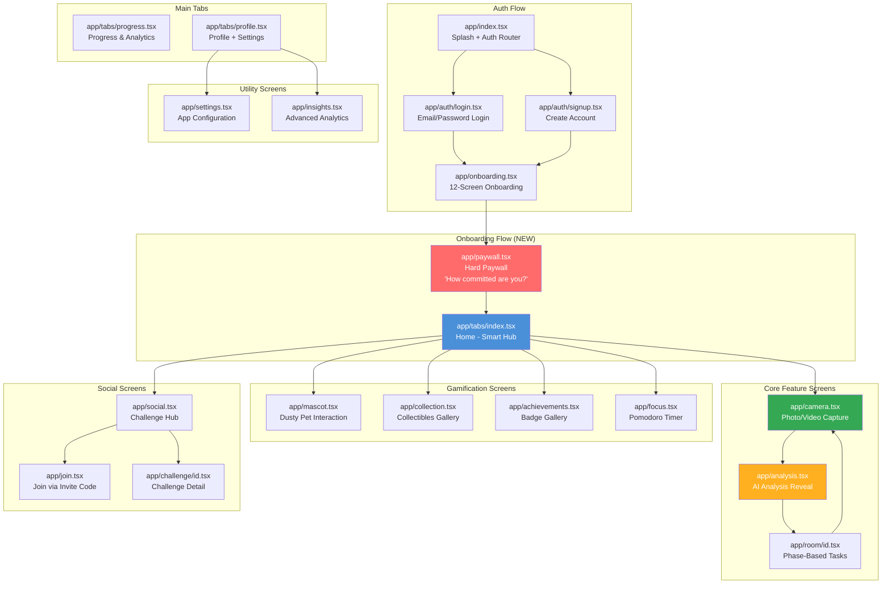
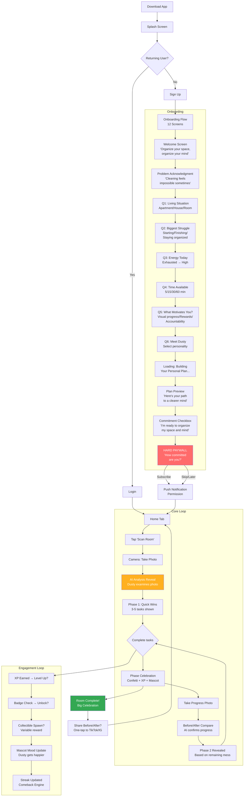
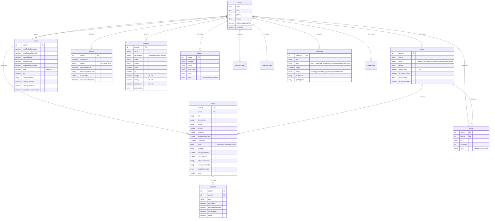
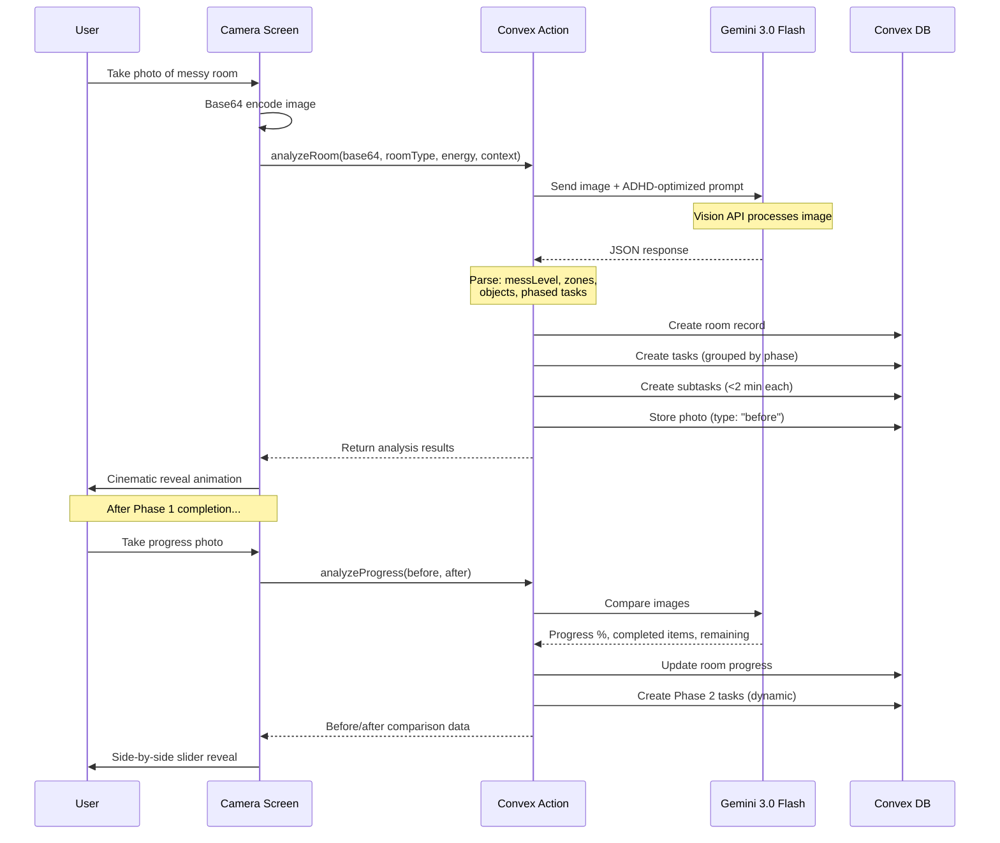

# Declutter: Organize Your Space, Organize Your Mind
## Complete Product Strategy, Architecture & Launch Blueprint

*March 2026 | v2.0 — Synthesized from 60+ web searches, codebase analysis, competitor teardowns, psychology research, and RevenueCat 2026 data*

---

## BRAND PHILOSOPHY

> **"Organize your space, organize your mind."**

This isn't just a cleaning app. It's a mental health tool disguised as a cleaning app. For people with ADHD, a messy space isn't just messy — it's a constant source of cognitive overload, shame, and executive dysfunction. When the space clears, the mind follows. Every feature, every notification, every pixel serves this philosophy.

---

## TABLE OF CONTENTS

1. [The Opportunity](#the-opportunity)
2. [System Architecture](#system-architecture)
3. [Screen-by-Screen Breakdown](#screen-by-screen-breakdown)
4. [User Flow](#user-flow)
5. [Onboarding & Hard Paywall](#onboarding--hard-paywall)
6. [Core Experience: Snap → Phase → Celebrate](#core-experience)
7. [Gamification System](#gamification-system)
8. [The Mascot: Dusty](#the-mascot-dusty)
9. [Backend Architecture](#backend-architecture)
10. [AI Pipeline](#ai-pipeline)
11. [App Store Optimization (vs Sweepy)](#app-store-optimization)
12. [Monetization & Paywall](#monetization--paywall)
13. [Go-to-Market Strategy](#go-to-market-strategy)
14. [Success Metrics](#success-metrics)
15. [Immediate Next Steps](#immediate-next-steps)

---

## THE OPPORTUNITY

### Why This App Needs to Exist

**495 million people worldwide have ADHD.** For them, cleaning isn't about laziness — it's about executive dysfunction. The ADHD brain has lower baseline dopamine, making non-urgent, non-novel tasks physically difficult to start.

The vicious cycle:
1. **Task initiation failure** → Can't start cleaning
2. **Overwhelm** → Looking at a messy room triggers paralysis
3. **Doom piling** → Clutter accumulates in "doom piles" that feel insurmountable
4. **Shame spiral** → Guilt about the mess makes starting even harder
5. **Decision fatigue** → "Where do I even begin?" kills momentum
6. **Cognitive overload** → Messy space = messy mind, compounding ADHD symptoms

**No app on the market solves this with AI + photo analysis + ADHD-specific gamification.** That's the gap.

### Market Size

| Metric | Value |
|--------|-------|
| Global ADHD population | ~495M people |
| US adults with ADHD | 15.5M (6.0%) |
| ADHD app market (2026) | ~$2.78B, growing 15.65% CAGR |
| Projected ADHD app market (2029) | $4.06B |
| Cleaning app market | $0.33-1.2B, growing 7.8-12.5% CAGR |
| ADHD adults who say clutter causes most stress | 30% |
| ADHD adults dissatisfied with organization skills | 60% |

### Competitor Landscape

| App | What They Do | Rating | Revenue | Category | What's Missing |
|-----|-------------|--------|---------|----------|----------------|
| **Sweepy** | Schedule-based cleaning, cleanliness meter, virtual rooms | 4.7★ (9.5K reviews) | $40-70K/mo | Productivity | No AI, no photo analysis, no ADHD focus |
| **Tody** | Need-based cleaning schedules, Pomodoro timer | 4.8★ (20K+ reviews) | ~$20K/mo | Productivity | No AI, no gamification depth |
| **Habitica** | RPG gamification for all habits | 4.5★ | $5/mo | Productivity | Not cleaning-specific, too complex for ADHD |
| **Finch** | Self-care virtual pet | 4.9★ | $9.99/mo | Health & Fitness | No cleaning focus, no AI |
| **FlyLady** | Routine-based cleaning system | 3.8★ | $38/yr | Lifestyle | Outdated, overwhelming |
| **UFYH** | Timer-based cleaning bursts | 4.2★ | $2.99 one-time | Productivity | No AI, minimal gamification |
| **Clean AI/Chore Snap** | AI photo → cleaning tasks | New | Unknown | Utilities | No gamification, no ADHD focus, no phases |
| **Roomsy** | AI schedule + virtual pet cat | New | Unknown | Lifestyle | Limited features, smaller scope |

**The gap: Nobody combines AI camera analysis + ADHD-optimized phased tasks + Duolingo-level gamification + "organize your space, organize your mind" philosophy.**

---

## SYSTEM ARCHITECTURE

### High-Level Architecture Diagram



### Data Flow Diagram



---

## SCREEN-BY-SCREEN BREAKDOWN

### Complete Screen Map



### Screen Details

#### 1. Splash Screen (`app/index.tsx`)
- Auth state check (Convex Auth)
- Animated app logo
- Routes to Login/Signup or Home based on session

#### 2. Login (`app/auth/login.tsx`)
- Email + password fields
- Apple Sign In / Google Sign In
- "Create Account" link
- Anonymous session option

#### 3. Signup (`app/auth/signup.tsx`)
- Name, email, password, phone
- Validates input
- Creates user via `convex/auth.ts → signUp`
- Routes to Onboarding

#### 4. Onboarding (`app/onboarding.tsx`) — **REDESIGNED**
- 12-screen commitment-building flow (see detailed section below)
- Personalization questions
- Mascot selection
- Ends with hard paywall

#### 5. Paywall (`app/paywall.tsx`) — **NEW**
- "How committed are you?" commitment selector
- Animated plan comparison
- 3-day free trial CTA
- RevenueCat integration
- Social proof ("10,000+ ADHD warriors joined")

#### 6. Home Tab (`app/(tabs)/index.tsx`)
- Smart greeting based on time of day + streak status
- Grace messaging if away 2+ days ("Welcome back!")
- Energy check-in (exhausted/low/moderate/high)
- Time availability selector (5/15/30/60 min)
- Active rooms with progress
- "Scan a Room" primary CTA
- Dusty mascot mini-widget

#### 7. Camera (`app/camera.tsx`)
- expo-camera integration
- Room type selector (bedroom, kitchen, bathroom, living room, office, closet, garage)
- Photo quality hints overlay
- Pinch-to-zoom, flash toggle
- Gallery picker option (expo-image-picker)
- Countdown timer for steady shots

#### 8. AI Analysis (`app/analysis.tsx`)
- Cinematic reveal animation (Apple TV style)
- Dusty mascot "examining" the photo
- Mess level visualization (0-100 scale)
- Zone identification with photo overlay
- Detected objects highlighted
- Phase breakdown preview
- "Start Phase 1" CTA

#### 9. Room Detail (`app/room/[id].tsx`)
- **Phase-based task display** (shows only current phase)
- Each task: title, emoji, estimated time, difficulty badge
- Expandable subtasks (each <2 min)
- Task completion → haptic + animation + XP popup
- Phase progress bar
- "Take Progress Photo" between phases
- Before/after slider comparison
- Phase celebration screen on phase complete

#### 10. Progress Tab (`app/(tabs)/progress.tsx`)
- Weekly activity bar chart
- Activity rings (tasks, time, rooms)
- Streak display with Comeback Engine
- Monthly cleaning sessions count
- Before/after photo gallery
- Mental clarity correlation hint ("Your space has been 73% cleaner this week")

#### 11. Profile Tab (`app/(tabs)/profile.tsx`)
- Hero card: name, avatar, level, XP progress bar
- "Organize your space, organize your mind" subtitle
- Grouped settings list
- Share profile button
- Logout

#### 12. Mascot (`app/mascot.tsx`)
- Full-screen Dusty interaction
- Stats: hunger, energy, happiness (0-100)
- Mood states: ecstatic, happy, content, neutral, sleepy, excited
- Feed button (task completion feeds Dusty)
- Personality selection (spark/bubbles/dusty/tidy)
- Accessory customization (earned via Sparkles currency)
- Dusty's reactions and dialogue

#### 13. Collection (`app/collection.tsx`)
- Collectibles grid with rarity colors
- Categories: Sparkles, Tools, Creatures, Treasures, Special
- Rarity tiers: Common, Uncommon, Rare, Epic, Legendary
- Completion percentage per category
- ~30+ collectible items
- Spawn notifications

#### 14. Achievements (`app/achievements.tsx`)
- Badge gallery with category filters (tasks/rooms/streak/time)
- 11 badges: First Step, Getting Going, Cleaning Machine, Declutter Master, Room Conquered, Home Hero, Consistent, Week Warrior, Monthly Master, Hour Power, Time Investor
- Earned vs locked toggle
- Unlock animations

#### 15. Focus Mode (`app/focus.tsx`)
- Pomodoro timer (5/15/25/45 min presets)
- Animated ring progress
- Haptic milestones every 5 min
- Break timer
- Focus settings: white noise, block notifications, strict mode
- Motivational quotes between sessions

#### 16. Social Hub (`app/social.tsx`)
- Quick challenge templates (15-min speed clean, trash bag challenge, room blitz, 7-day streak)
- Create custom challenges
- Join via invite code
- Active challenges list

#### 17. Challenge Detail (`app/challenge/[id].tsx`)
- Participant progress
- Challenge type (tasks_count/time_spent/room_complete/streak/collectibles)
- Leaderboard
- Status tracking

#### 18. Settings (`app/settings.tsx`)
- Theme (light/dark/auto)
- Notifications toggle
- Haptic feedback toggle
- Encouragement level
- Task breakdown level
- Focus mode settings (duration, break, white noise type)
- AR collection toggle
- Collectible notifications

#### 19. Insights (`app/insights.tsx`)
- Advanced analytics
- Room-by-room cleaning history
- Time patterns
- Most productive days/times
- Mental clarity correlation

---

## USER FLOW

### Complete User Journey



---

## ONBOARDING & HARD PAYWALL

### Research-Backed Flow Design

Based on analysis of Noom, Calm, Fastic, Fabulous, and BetterMe — apps that convert at 10-15%+ with hard paywalls after onboarding.

**Key Principles:**
- 12-15 onboarding screens is optimal (apps with 5+ personalization questions see 40% higher conversion)
- Each question must visibly change something in the user experience
- Build **sunk cost** — by the time they see the paywall, they've invested 2-3 minutes of personal data
- **Commitment consistency** (Cialdini) — small "yes" commitments escalate to the big "yes" (subscribe)
- 55% of trial cancellations happen on Day 0 — the "aha moment" must occur in the first session

### Screen-by-Screen Onboarding

**Screen 1: Welcome**
- Dusty mascot animated entrance
- "Organize your space, organize your mind"
- "Let's build your personal cleaning plan"
- [Get Started] button

**Screen 2: Problem Acknowledgment**
- "Cleaning feels impossible sometimes. That's not your fault."
- "Your brain works differently — and that's okay."
- Gentle illustration of messy room → clear room
- [I Feel This] button (micro-commitment #1)

**Screen 3: Living Situation**
- "Where do you live?"
- Options: Studio / Apartment / House / Dorm Room / Shared Space
- Visual icons for each
- Affects AI task generation scope

**Screen 4: Biggest Cleaning Struggle**
- "What's hardest for you?"
- Options: Getting started / Staying focused / Finishing what I start / Knowing where to begin / All of the above
- Multi-select allowed
- Affects notification strategy and task ordering

**Screen 5: Energy Level**
- "How's your energy usually?"
- Slider: Exhausted → Low → Moderate → High → Hyper-focused
- Affects default task count per phase

**Screen 6: Time Availability**
- "How much time can you give today?"
- Options: Just 5 min / 15 min / 30 min / An hour
- Affects phase length

**Screen 7: Motivation Style**
- "What motivates you most?"
- Options: Seeing visual progress / Earning rewards / Competing with friends / Caring for a pet / Before/after transformations
- Affects which gamification features are highlighted

**Screen 8: Meet Dusty**
- "Meet your cleaning companion!"
- Dusty appears with animation
- Select personality: Spark (energetic), Bubbles (calm), Dusty (silly), Tidy (organized)
- [Choose Companion] button

**Screen 9: Building Your Plan (Loading)**
- Animated progress bar with personality
- "Analyzing your preferences..."
- "Calibrating difficulty for your energy..."
- "Teaching Dusty about your space..."
- 3-5 second faux loading (builds anticipation)

**Screen 10: Your Personal Plan Preview**
- "Here's your path to a clearer mind"
- Personalized plan card showing:
  - "Phase-based cleaning for [their living situation]"
  - "Tasks adjusted for [their energy level]"
  - "[Their motivation style] rewards enabled"
  - "Dusty ([personality]) is ready to help"
- [This Looks Perfect] button (micro-commitment #2)

**Screen 11: Commitment Checkbox**
- "One last thing..."
- Checkbox: "I'm ready to organize my space and organize my mind ✨"
- Fabulous-style — this checkbox commitment drove a 16x increase in their downloads-to-active conversion
- [Let's Go] button (micro-commitment #3)

**Screen 12: HARD PAYWALL**
- See detailed paywall section below

### Post-Paywall

**Screen 13: Push Notification Permission**
- Custom pre-primer screen (NOT the system dialog yet)
- "Dusty wants to cheer you on!"
- "Get gentle reminders that actually help — never guilt, always encouragement"
- "ADHD brains need external cues. Let Dusty be yours."
- [Enable Reminders] → System dialog
- [Maybe Later] → Skip

**Screen 14: First Task**
- Immediately route to Home with "Scan Your First Room" prompt
- Make the first action happen within 60 seconds of completing onboarding

---

## THE HARD PAYWALL

### "How Committed Are You?" Paywall Design

**Research backing:**
- Hard paywalls achieve **12.11% median conversion** vs 2.18% for freemium (RevenueCat 2026)
- Subscribers from hard paywalls have **21% higher LTV**
- Animated paywalls convert **2.9x higher** than static
- Adding the user's name increases conversion by **17%**
- 82% of trial starts happen on install day — this IS the moment

### Paywall Screen Layout

```
┌─────────────────────────────────┐
│                                 │
│   ✨ [Name], your plan is ready │
│                                 │
│   "Organize your space,        │
│    organize your mind"          │
│                                 │
│   ┌───────────────────────┐     │
│   │ How committed are you? │     │
│   │                       │     │
│   │ 🌱 Casual             │     │
│   │ "I'll clean when I    │     │
│   │  feel like it"        │     │
│   │ $6.99/week            │     │
│   │                       │     │
│   │ 🔥 Committed (POPULAR)│     │
│   │ "I want a cleaner     │     │
│   │  space & clearer mind"│     │
│   │ $6.99/month           │     │
│   │ 3-DAY FREE TRIAL      │     │
│   │                       │     │
│   │ 💎 All-In (BEST VALUE)│     │
│   │ "I'm transforming my  │     │
│   │  life starting today" │     │
│   │ $39.99/year ($3.33/mo)│     │
│   │ 3-DAY FREE TRIAL      │     │
│   └───────────────────────┘     │
│                                 │
│   ✅ Unlimited AI room scans    │
│   ✅ Phase-based cleaning plans  │
│   ✅ Before/after progress       │
│   ✅ Full Dusty customization    │
│   ✅ Achievements & collectibles │
│                                 │
│   "10,847 ADHD warriors joined  │
│    this month"                  │
│                                 │
│   [Start Free Trial]            │
│                                 │
│   Restore Purchase | Terms      │
│   ─────────────────────────     │
│   Skip for now (limited access) │
│                                 │
└─────────────────────────────────┘
```

### Paywall Psychology

1. **Commitment framing** — "How committed are you?" uses Cialdini's commitment/consistency principle. Users who self-identify as "Committed" or "All-In" feel internal pressure to follow through
2. **Price anchoring** — Weekly plan at $6.99/week ($364/yr) makes annual at $39.99/yr look like a steal
3. **Identity labels** — Each tier has an identity statement, not just a price. "I'm transforming my life" is aspirational
4. **Social proof** — "10,847 ADHD warriors joined this month" normalizes the purchase
5. **Loss aversion** — "3-day free trial" feels risk-free; the animated paywall Dusty mascot creates emotional investment
6. **Default selection** — "Committed" tier pre-selected with "POPULAR" badge
7. **Soft exit** — "Skip for now" allows limited access (3 scans/month, no phases, no collectibles)

### Trial Strategy: 3-Day Free Trial

**Why 3 days (not 7):**
- Creates urgency — user must experience value FAST
- 55% of cancellations happen Day 0 regardless of trial length
- Forces the "aha moment" into the first session
- Weekly + trial is the highest-LTV configuration at $49.27/12 months (RevenueCat data)
- Apple is now rejecting toggle-style trial paywalls — use button-style

**Day 0 (Critical):** User must complete at least 1 room scan + Phase 1 tasks
**Day 1:** Push notification: "Your room looked amazing yesterday! Ready for Phase 2?"
**Day 2:** Push notification: "Trial ends tomorrow. Your progress so far: [stats]"
**Day 3:** In-app modal: "Your trial ends today. Keep your momentum?"

### Limited Free Access (for users who skip paywall)

- 3 AI room scans per month
- Basic task list (no phases)
- Basic streak tracking
- Mascot with limited customization
- No collectibles or achievements
- Banner: "Upgrade to unlock phases, progress tracking, and Dusty customization"

---

## CORE EXPERIENCE

### "Snap → Phase → Celebrate" — The Magic Loop

```
📸 SNAP your messy room
    ↓
🤖 AI breaks it into PHASES (3-5 tasks each)
    ↓
✅ Complete Phase 1 (Quick Wins - highest visual impact first)
    ↓
🎉 CELEBRATE (confetti, XP, mascot reaction, before/after comparison)
    ↓
📸 SNAP progress photo
    ↓
🤖 AI confirms progress, reveals Phase 2
    ↓
🔄 Repeat until room is clean (or energy runs out — both celebrated)
```

### Why This Works for ADHD Brains

| ADHD Challenge | How Declutter Solves It |
|----------------|----------------------|
| **Can't start** | AI tells you EXACTLY what to do first |
| **Overwhelm** | Only shows 3-5 tasks at a time (Cowan's working memory limit) |
| **No dopamine** | Immediate rewards after every task and phase |
| **Decision fatigue** | Zero decisions needed — AI decides for you |
| **Time blindness** | Each subtask has time estimates (<2 min each) |
| **Shame spiral** | Non-judgmental language, celebrates returning after gaps |
| **Doom piling** | AI specifically identifies and breaks down doom piles |
| **Need novelty** | Different cleaning "quests", collectibles, mascot reactions |
| **Cognitive overload** | Cleaner space = clearer mind, reinforced in copy |

### Phase Design

**Phase 1: Quick Wins** (Visual Impact First — "Operation Floor Rescue")
- Tasks with biggest visible difference
- "Pick up the 3 clothing items on your couch"
- Optimized for dopamine hit of seeing visible change
- 3-5 tasks, subtasks under 2 minutes each
- Estimated: 5-10 min

**Phase 2: Surface Level** ("Counter Strike")
- Clear flat surfaces (tables, counters, desks)
- Group similar items together
- Medium-effort tasks that build on Phase 1 momentum
- Estimated: 10-15 min

**Phase 3: Deep Clean** ("The Final Sparkle" — only if energy allows)
- Organization, putting things away properly
- Optional — app celebrates if user only does Phase 1 or Phase 2
- No guilt for stopping early
- "You've done amazing. Stopping here is a win."
- Estimated: 10-20 min

**Key Innovation: Progress Photo Between Phases**
After Phase 1, user takes another photo. The AI:
- Shows **side-by-side comparison** with interactive slider
- Calculates **progress percentage** with satisfying animation
- Names specific changes ("The 4 cups on the desk are gone!")
- Reveals Phase 2 tasks based on what's ACTUALLY left
- Dusty reacts: "Ooh, I can see the floor now!"

---

## GAMIFICATION SYSTEM

### The Duolingo Playbook (Adapted for ADHD)

| Duolingo Feature | Declutter Adaptation |
|-----------------|---------------------|
| **Daily streak** | "Tidy streak" with **Comeback Engine** (no shame for missing days) |
| **XP system** | XP for tasks, bonus XP for visual-impact tasks |
| **Leagues** | Optional "Tidy Leagues" with weekly leaderboards |
| **Hearts system** | Skip — too punishing for ADHD |
| **Streak freeze** | Yes, generous (2-3 free per week) |
| **Daily goal** | Adaptive: "Even 1 task counts" on low-energy days |
| **Gems/currency** | "Sparkles" earned by cleaning, spent on Dusty customization |
| **Friend streaks** | "Cleaning buddy" streaks with friends |
| **Notifications** | Humorous, never guilt-inducing |

### The Comeback Engine (Critical for ADHD)

Traditional streaks PUNISH absence. For ADHD users, this causes shame spirals. Instead:

- **No streak reset screen.** Ever.
- **Cumulative tracking**: "You've cleaned 47 times total!" > "Day 3 streak"
- **Grace periods**: 48-hour buffer before streak counts as broken
- **Welcome back messages**: "Hey! Your room missed you 💛"
- **One Tiny Thing re-entry**: ONE task under 60 seconds to get back in
- **Streak alternatives**: "Cleaning sessions this month: 12"
- **Comeback bonus**: Extra XP for returning after a gap — "Coming back is harder than continuing. You deserve more credit."

### Reward Layers (Variable Rewards)

```
Layer 1: TASK COMPLETE → haptic buzz + satisfying sound + checkmark animation
Layer 2: PHASE COMPLETE → confetti + before/after comparison + XP burst
Layer 3: ROOM COMPLETE → big celebration + mascot dance + badge unlock chance
Layer 4: DAILY GOAL MET → streak maintained + daily bonus XP
Layer 5: WEEKLY MILESTONE → collectible item spawn + mascot evolution
Layer 6: MONTHLY ACHIEVEMENT → special badge + profile flair + "mind clarity" stat
```

---

## THE MASCOT: DUSTY

### Why a Dust Bunny?

- Directly related to cleaning (on-brand)
- Starts messy → gets cleaner as you clean (visual metaphor for "organize mind")
- Inherently cute and non-threatening
- Slightly messy itself (relatable — "we're in this together")
- Perfect for memes and social content
- Never. Guilt. Trips.

### Dusty Mechanics

- **Mood**: ecstatic, happy, content, neutral, sleepy, excited (NEVER sad/disappointed)
- **Appearance evolves** with user level (accessories, sparkles, cleaner fur)
- **Reactions during cleaning**: "That counter is SPARKLING!" "Is that... the floor?! I forgot what it looked like!"
- **Morning greetings** vary by day/streak/weather
- **Customizable** with Sparkles currency (outfits, accessories, colors)
- **Hunger/Energy/Happiness** stats (0-100) — fed by task completion
- **Personalities**: Spark (energetic), Bubbles (calm), Dusty (silly), Tidy (organized)

---

## BACKEND ARCHITECTURE

### Database Schema



### Backend Functions (Convex)

| File | Function | Type | Purpose |
|------|----------|------|---------|
| `gemini.ts` | `analyzeRoom` | Action | Send photo to Gemini, get tasks |
| `gemini.ts` | `analyzeProgress` | Action | Compare before/after photos |
| `gemini.ts` | `getMotivation` | Action | Context-aware motivation messages |
| `gemini.ts` | `isConfigured` | Query | Check if Gemini API key is set |
| `tasks.ts` | `listByRoom` | Query | Get tasks for a room |
| `tasks.ts` | `create` | Mutation | Create a new task |
| `tasks.ts` | `complete` | Mutation | Mark task done, trigger XP/badges |
| `tasks.ts` | `delete` | Mutation | Remove a task |
| `subtasks.ts` | `create` | Mutation | Create subtask |
| `subtasks.ts` | `complete` | Mutation | Mark subtask done |
| `subtasks.ts` | `list` | Query | Get subtasks for task |
| `stats.ts` | `get` | Query | Get user stats |
| `stats.ts` | `upsert` | Mutation | Update stats + level calc |
| `stats.ts` | `checkAndUnlock` | Mutation | Check badge thresholds |
| `badges.ts` | `listByUser` | Query | Get earned badges |
| `badges.ts` | `unlock` | Mutation | Grant a badge |
| `rooms.ts` | `create/list/update/delete` | Mixed | CRUD for rooms |
| `rooms.ts` | `updateProgress` | Mutation | Update room progress % |
| `mascots.ts` | `createOrGet` | Mutation | Init or fetch mascot |
| `mascots.ts` | `feed/interact/updateMood` | Mutation | Mascot interactions |
| `collection.ts` | `addItem/listByUser/getStats` | Mixed | Collectibles system |
| `social.ts` | `createChallenge/joinChallenge` | Mutation | Social challenges |
| `social.ts` | `listChallenges/getMyChallenges` | Query | Browse challenges |
| `settings.ts` | `getOrCreate/update` | Mixed | User preferences |
| `auth.ts` | `signUp/login/logout` | Mutation | Authentication |
| `photos.ts` | `uploadPhoto/listByRoom` | Mixed | Photo management |
| `users.ts` | `createOrUpdate/getProfile` | Mixed | User profiles |
| `sync.ts` | Complex sync logic | Mixed | Offline-first data sync |

---

## AI PIPELINE

### Analysis Flow



### AI Prompt Strategy

**Current strengths:**
- Non-judgmental language ✅
- Visual impact ordering (dopamine-first) ✅
- Subtasks under 2 minutes ✅
- Zone identification ✅
- whyThisMatters & resistanceHandler fields ✅

**Improvements for v2:**

1. **Phase grouping**: AI returns tasks grouped into 3 phases, not a flat list
2. **Adaptive difficulty**: Energy check-in adjusts task count
   - "Exhausted" → Phase 1 only (3 quick-win tasks)
   - "High energy" → Full 3-phase plan
3. **Doom pile detection**: Specific identification of doom piles with targeted workflow
4. **Progress photo intelligence**: Names specific changes ("The 4 cups on the desk are gone!")
5. **Fun phase names**: "Operation Floor Rescue", "Counter Strike", "The Final Sparkle"
6. **Supply check**: "Before you start, grab: a trash bag and your phone charger"
7. **Mind-space connection**: Include a `mentalBenefit` field — "Clearing this surface will reduce visual noise and help you focus"

---

## APP STORE OPTIMIZATION (vs Sweepy)

### Sweepy's Current ASO (What We're Beating)

| Field | Sweepy | Notes |
|-------|--------|-------|
| **Title** | Sweepy: Home Cleaning Schedule | Generic, no ADHD keywords |
| **Subtitle** | Cleaning Chore Planner | Generic |
| **Category** | Productivity | Standard |
| **Rating** | 4.7★ (9,487 reviews) | Strong but beatable |
| **Price** | Free / $12.99-19.99/yr | Low price point |

**Sweepy's weakness:** Zero ADHD positioning despite being popular with ADHD users. No AI features. No "organize your mind" messaging.

### Declutter's ASO Strategy

**App Store Title** (28 chars):
```
Declutter: ADHD Cleaning App
```

**Subtitle** (27 chars):
```
Organize Space & Your Mind
```

**Keyword Field** (100 chars, comma-separated — zero overlap with title/subtitle):
```
cleaning schedule,chore planner,home organization,tidy,messy room,gamified,AI scan,dust,motivation
```

**Promotional Text** (170 chars — can be updated without review):
```
NEW: AI-powered room scanning! Snap a photo, get instant cleaning phases designed for ADHD brains. Organize your space, organize your mind. 3-day free trial available now.
```

### Full App Store Description (4000 chars)

```
ORGANIZE YOUR SPACE, ORGANIZE YOUR MIND

Declutter is the AI-powered cleaning companion designed specifically for ADHD brains. Take a photo of any messy room and get an instant, personalized cleaning plan broken into bite-sized phases — so you can finally get started without the overwhelm.

━━━━━━━━━━━━━━━━━━━━━

WHY DECLUTTER IS DIFFERENT

🧠 BUILT FOR ADHD BRAINS
Every feature is designed around executive dysfunction, not against it. No shame, no guilt, no overwhelming to-do lists. Just clear, tiny steps that your brain can actually start.

📸 AI ROOM SCANNING
Snap a photo of your messy room. Our AI analyzes it instantly and creates a personalized cleaning plan with specific tasks — "Pick up the 3 shirts on your couch" not "clean the living room."

⚡ PHASE-BASED CLEANING
Tasks are grouped into 3 phases:
• Phase 1: Quick Wins (biggest visual impact first — instant dopamine!)
• Phase 2: Surfaces (clear the counters and tables)
• Phase 3: Deep Clean (only if you have the energy — stopping early is celebrated!)

📊 BEFORE & AFTER PROGRESS
Take a progress photo between phases and watch the AI highlight exactly what changed. See your transformation in a satisfying side-by-side comparison.

━━━━━━━━━━━━━━━━━━━━━

GAMIFIED TO KEEP YOU GOING

🔥 Smart streaks with the Comeback Engine — we celebrate your return, never punish your absence
⭐ Earn XP, level up, and unlock achievements
🐰 Meet Dusty, your cleaning companion who gets happier as you clean
🏆 Collect rare items with every completed task
👥 Challenge friends to cleaning competitions
⏱️ Focus timer with cleaning-specific presets

━━━━━━━━━━━━━━━━━━━━━

WHAT USERS SAY

"I've tried every cleaning app. This is the first one that actually understands my ADHD brain." — Sarah K.

"The before/after photos are SO satisfying. I actually look forward to cleaning now." — Marcus T.

"Dusty makes me smile every time I open the app. It's like having a supportive friend." — Jamie L.

━━━━━━━━━━━━━━━━━━━━━

ORGANIZE YOUR SPACE, ORGANIZE YOUR MIND

Research shows that cluttered environments increase cortisol and decrease focus — especially for ADHD brains. Declutter isn't just about clean rooms. It's about mental clarity, reduced anxiety, and a calmer mind.

━━━━━━━━━━━━━━━━━━━━━

DECLUTTER PRO INCLUDES:
✅ Unlimited AI room scans
✅ Phase-based cleaning plans
✅ Before/after progress tracking
✅ Full Dusty customization
✅ Achievements & collectibles
✅ Social challenges
✅ Focus timer
✅ Priority AI processing

Start your 3-day free trial today. No commitment — cancel anytime.

Privacy: Your room photos are processed securely and never shared.
```

### Screenshot Strategy (5 Slots)

1. **Before/After split** — Messy room → Clean room with "Snap. Phase. Celebrate." overlay
2. **AI Analysis** — Phone showing AI analyzing a room with task list appearing. "AI sees your room. You get a plan."
3. **Phase Tasks** — Task list with Phase 1 highlighted. "Bite-sized steps your ADHD brain loves."
4. **Dusty Mascot** — Dusty celebrating with confetti. "Meet your cleaning companion."
5. **Gamification** — Streaks, XP, badges, collectibles. "Level up while you tidy up."

### Category Strategy

**Primary: Health & Fitness** (less competition than Productivity, aligns with "organize your mind" positioning)
**Secondary: Productivity** (where Sweepy lives — cross-pollinate keywords)

---

## MONETIZATION & PAYWALL

### Pricing Tiers

| Tier | Price | Annual Equivalent | Notes |
|------|-------|-------------------|-------|
| **Weekly** (anchor) | $6.99/week | $364/yr | Price anchor — makes annual look cheap |
| **Monthly** | $6.99/month | $84/yr | Mid-tier, "Committed" |
| **Annual** (best value) | $39.99/year | $3.33/mo | Pre-selected default, "All-In" |

**Why this pricing:**
- Sweepy: $12.99-19.99/yr (no AI, simpler features)
- Finch: $9.99/mo (virtual pet only, no AI)
- Tody: $59.99/yr (no AI, no gamification)
- Global median subscription: $38.42/yr
- $39.99/yr is above Sweepy but justified by AI features
- Weekly plan exists purely as price anchor (few will choose it)

### Revenue Projections

| Scenario | Monthly Revenue | Timeline | Assumptions |
|----------|----------------|----------|-------------|
| **Conservative** | $300-500/mo | Month 3 | Organic only, 500 downloads/mo, 3% conversion |
| **Moderate** | $2-5K/mo | Month 6 | TikTok content, 2K downloads/mo, 5% conversion |
| **Optimistic** | $10-20K/mo | Year 1 | Viral TikTok, 10K downloads/mo, 5% conversion |
| **Exceptional** | $40-70K/mo | Year 2+ | Sweepy-level (they did it with 2 people) |

---

## GO-TO-MARKET STRATEGY

### Launch Timeline

| When | Action |
|------|--------|
| **Now (Mar 2026)** | Finalize V1, start TikTok account, engage Reddit |
| **Apr-May** | Beta test with 50-100 ADHD users, collect testimonials |
| **Jun-Jul** | Refine based on feedback, build social presence |
| **Aug-Sep** | App Store submission, prepare launch assets |
| **Oct 2026** | **Major launch during ADHD Awareness Month** |
| **Nov-Dec** | Iterate, "New Year, New Space" campaign prep |
| **Jan 2027** | "New Year, New Space, New Mind" push |

### Growth Channels (Priority Order)

1. **TikTok** — Before/after room transformations, ADHD cleaning content, Dusty mascot content. Micro-influencers at $100-300/collab deliver 8.2% engagement rate. CleanTok + ADHD content are massive categories.

2. **Reddit** — r/ADHD (2.3M), r/declutter (800K), r/cleaning, r/ADHDwomen. Authentic engagement converts 22x better than Product Hunt.

3. **Instagram** — Before/after carousels, Dusty content, Reels showing app in action.

4. **Product Hunt** — Good for credibility, target a Saturday launch (only 366 upvotes needed for #1).

5. **ADHD Awareness Month (October)** — Partner with CHADD, ADDA. Frame as education + community, not pure commercial.

### Viral Loop: Before/After Sharing

```
User cleans room with app → Takes before/after photos →
One-tap share with Declutter watermark → Friends download →
They clean and share → 🔄 Repeat
```

### Content Flywheel

- "I let AI clean my room" TikToks
- Relatable ADHD doom pile content
- Dusty mascot memes and reactions
- User transformation stories
- "Organize your space, organize your mind" brand content

---

## 2026 FEATURES TO LEVERAGE

### Platform Features

| Feature | Platform | Priority | Implementation |
|---------|----------|----------|----------------|
| **Live Activities / Dynamic Island** | iOS | High | Show active cleaning timer, current task on lock screen. Use `expo-live-activity` or Voltra. |
| **Home Screen Widgets** | iOS + Android | Medium | Daily task, streak count, Dusty mood. Use Expo widgets API. |
| **Siri / Google Gemini Integration** | Both | Medium | "Hey Siri, start a cleaning session" via AppIntents / AppFunctions. |
| **HealthKit Integration** | iOS | Low | Track "cleaning minutes" as activity. Correlate with mood data. |
| **Apple Intelligence** | iOS | Future | On-device room analysis for faster/offline processing. |
| **Shortcuts / Automations** | iOS | Low | "When I arrive home, suggest a 5-minute clean." |

### Feature Priorities for V1

**Must-Have (Launch):**
1. Snap → Phase → Celebrate core loop
2. AI room analysis with phase breakdown
3. Progress photo comparison (before/after slider)
4. Hard paywall with 3-day trial (RevenueCat)
5. 12-screen onboarding with commitment flow
6. Basic gamification (XP, levels, Comeback Engine)
7. Dusty mascot with mood/reactions
8. Push notifications (ADHD-friendly)

**V1.1 (Month 2-3):**
9. Social challenges
10. Collectibles system
11. Focus timer
12. Achievement badges
13. Share feature (one-tap before/after)
14. Live Activities for cleaning timer

**V2+ (Future):**
15. Tidy Leagues (weekly leaderboards)
16. Body doubling mode (virtual co-cleaning)
17. Home Screen widgets
18. Doom pile specialist mode
19. Room history/analytics
20. Family/roommate mode
21. Siri/Gemini voice integration
22. Apple Watch app

---

## NOTIFICATIONS STRATEGY (ADHD-Friendly)

### Principles
1. **Never guilt.** "You haven't cleaned in 3 days" = instant uninstall
2. **Humor over pressure.** Dusty's personality shines through
3. **Max 1-2 per day.** ADHD users are already overwhelmed
4. **Celebrate returns.** Always
5. **Actionable.** Every notification has a clear, low-barrier action
6. **Ask after paywall.** Custom pre-primer explaining ADHD-specific benefits

### Examples

**Morning:** "Good morning! Dusty's ready when you are. Even 60 seconds counts ☀️"

**Comeback:** "Hey stranger 💛 No judgment here. Wanna do one tiny thing?"

**Streak:** "You're 1 task away from keeping your tidy streak. 30 seconds? ⏰"

**Progress:** "Your living room has been clean for 3 days. Your mind thanks you ✨"

**NEVER:** "You haven't opened the app in X days" / "Your room might be getting messy"

---

## PSYCHOLOGICAL FRAMEWORKS

### "Organize Your Space, Organize Your Mind"
Research shows cluttered environments increase cortisol and decrease focus, especially for ADHD brains. Every feature reinforces: cleaner space → clearer mind.

### KC Davis "Struggle Care" Philosophy
- Care tasks are morally neutral
- Functioning is the goal, not perfection
- "Good enough" is celebrated
- Rest is productive

### Five Things Method (Adapted)
1. Trash → throw away
2. Dishes → kitchen
3. Laundry → hamper
4. Things with a place → put away
5. Things without a place → one box for now

### Commitment/Consistency (Cialdini)
Used in onboarding: small "yes" commitments escalate to the big "yes" (subscribe). Commitment checkbox drives 16x activation improvement.

---

## SUCCESS METRICS

### North Star Metric
**Weekly active cleaners** (users who complete at least 1 cleaning task per week)

| Metric | Target (Month 3) | Why It Matters |
|--------|------------------|----------------|
| WAU | 500+ | Core engagement |
| Day 1 Retention | 40%+ | Onboarding quality |
| Day 7 Retention | 20%+ | Core loop quality |
| Day 30 Retention | 10%+ | Long-term value |
| Paywall → Trial Start | 30%+ | Paywall effectiveness |
| Trial → Paid | 40%+ | Product value |
| Tasks/session | 5+ | Core loop engagement |
| Before/after shares/week | 50+ | Viral coefficient |
| App Store rating | 4.7+★ | Social proof |

---

## WHAT MAKES DECLUTTER WIN

### The Moat

1. **AI + Camera + ADHD Gamification** — Nobody else combines all three
2. **Dynamic phases** — Tasks adapt based on what the AI actually sees
3. **"Organize your mind"** — Cleaning positioned as mental health, not chores
4. **Progress photo comparison** — Visual proof of progress feeds dopamine
5. **ADHD-first design** — Every feature for executive dysfunction
6. **Comeback Engine** — Shame-free re-engagement
7. **Dusty** — Recognizable mascot brand character

### The One-Liner Pitch
**"Duolingo for cleaning your room — powered by AI, designed for ADHD brains. Organize your space, organize your mind."**

---

## IMMEDIATE NEXT STEPS

1. **Implement hard paywall** with RevenueCat + 3-day trial + "How committed are you?" screen
2. **Redesign onboarding** to 12-screen commitment flow
3. **Refine AI prompts** for phase-based output with fun phase names
4. **Build progress photo comparison** UI (interactive before/after slider)
5. **Design Dusty** mascot assets (illustrations/3D renders)
6. **Implement Comeback Engine** (replace current streak system)
7. **Update App Store listing** with new ASO copy (title, subtitle, keywords, description)
8. **Create TikTok account** and start posting ADHD cleaning content NOW
9. **Beta test** with 50-100 ADHD users (Reddit recruitment)
10. **Add "Organize your space, organize your mind"** branding everywhere

---

*This document synthesizes 60+ web searches across ADHD psychology, competitor analysis (Sweepy, Tody, Habitica, Finch, Clean AI), gamification research (Duolingo, Noom, Fastic, Fabulous), RevenueCat 2026 subscription data, App Store Optimization best practices, KC Davis's Struggle Care methodology, Cialdini's commitment/consistency principle, and complete codebase analysis of the existing Declutter app.*
